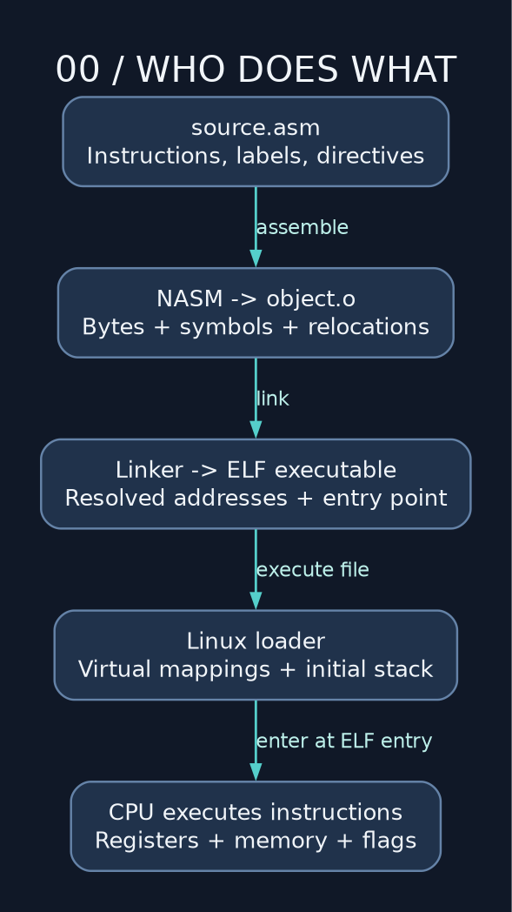

# 00 — Console online: what assembly actually is

> **NSD / FIRST CONTACT** — Crash on the console. We're going underneath the compiler, one layer at a time. First identify the machine, assembler, and OS. The silicon will not correct your paperwork.

**Prerequisites:** basic arithmetic; C examples help but are explained. **Target:** Linux userspace, x86-64, NASM Intel syntax, System V AMD64 ABI.

We start in userspace. Linux supplies the process, virtual memory, and system calls while we learn the instructions. The blacksite aesthetic does not grant kernel privileges. Bootloaders and Windows have different startup and interface rules; keep those experiments separate for now.

For the background behind these names, keep [INFO DUMP](../INFO_DUMP.md) open: ISA versus ABI, pointers and data models, calling conventions, and what changes when assembly moves to another target.

## CPU, assembler, linker, kernel: know who does what

A CPU executes encoded machine instructions. NASM translates your source into an object file containing instruction bytes, data, symbols, and relocation records. The linker resolves references and produces an ELF executable. Linux maps that executable into a process and starts it at its entry address.



C normally gives us another stage in front of this: the compiler translates C into assembly or generates machine code through its internal machinery. Here we're supplying the assembly ourselves. GCC can still arrange the linking of a NASM object. That's toolchain plumbing; it doesn't secretly turn our instructions back into C.

The ISA is the behavior the CPU promises. A microarchitecture is how a particular CPU delivers it: pipelines, caches, execution units, speculation. One assembly instruction can involve more work than its one line suggests. Get it correct first. Then measure. I don't take cycle counts on faith.

## Get the tools and choose a directory

You need `nasm`, GNU `ld`/`objdump`/`readelf`, `gcc`. GDB is for inspection; Graphviz is only for rebuilding diagrams. On Debian/Ubuntu the package names are `nasm binutils gcc gdb graphviz`. Use your distribution's package manager; the tutorial does not install software automatically.

From the repository root:

```sh
cd nasm
mkdir -p build
nasm -f elf64 -g -F dwarf examples/00_start_here.asm -o build/00_start_here.o
gcc -no-pie build/00_start_here.o -o build/00_start_here
./build/00_start_here
```

Expected output: `CRASH@NSD: instruction stream online.` followed by a newline. All commands in later lessons assume you remain in this directory unless stated otherwise.

Read [the executable example](../examples/00_start_here.asm). It defines `main` and calls libc `puts`. The following smaller program instead starts directly at `_start`:

```nasm
bits 64
section .text
global _start
_start:
    mov eax, 60     ; Linux x86-64 exit syscall
    mov edi, 0      ; status
    syscall
section .note.GNU-stack noalloc noexec nowrite progbits
```

Save that snippet as `/tmp/first.asm`, then:

```sh
nasm -f elf64 -g -F dwarf /tmp/first.asm -o /tmp/first.o
ld /tmp/first.o -o /tmp/first
/tmp/first
echo $?
```

Expected status: `0`. No banner, no applause; the process exited successfully. Check `$?` immediately, before another command replaces the result you're trying to inspect.

## Read one source line

```nasm
again:  add eax, 13     ; destination first, source second
```

`again` labels an address; `add` is an instruction; `eax` names a register; `13` is an immediate constant. The semicolon begins a NASM comment. A label allocates no bytes by itself. Execution can fall through labels: there is no implicit end of function.

A directive such as `section .text` instructs the assembler. It is not an instruction executed by the CPU. `global _start` exports a symbol. `$` is the current assembly position; it is not a runtime instruction pointer variable.

## Entry point is not a normal function

Linux enters `_start` with startup information on the stack, including `argc` and `argv`. No caller pushed a return address. A bare `ret` would treat startup data as an instruction address. There is nobody to return to. Use the exit syscall and leave through the actual door.

`main` has a C runtime caller. It follows the function ABI and can return with `ret`; the runtime handles normal process cleanup. This course uses `main` only in chapters 00 and 06. Build each file separately: combining fifteen `_start` definitions is a linker error, not a larger lesson.

## Drill

Change `mov edi, 0` to `mov edi, 53`. Predict the status before running. Then use `objdump -d -Mintel /tmp/first` to find the instructions. Change the status to `689`: the shell reports `177`, its low eight bits. The register held 689; the exit-status interface exposed less.

**Checkpoint:** explain which tool consumes `.asm`, which consumes `.o`, and why `_start` cannot return like `main`.

---

[Course map](../README.md) · [Next: 01](01_registers_and_sizes.md)

Companion: [original GAS lecture](../../gas_asm_lecture/00_start_here.asm).

Manuals: [reference index](../REFERENCES.md).
