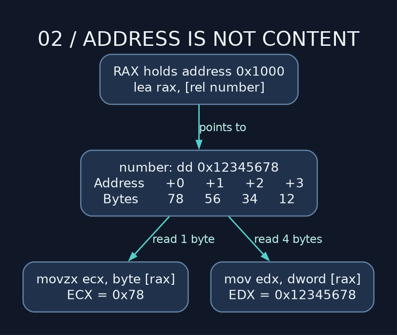

# 02 — Addresses, bytes, and pointer hell

> **NSD / MEMORY ACCESS** — Get the address. Check the width. Then touch the memory. I prefer that order; the other one tends to involve a fault dump.

**Lab:** [memory example](../examples/02_memory_and_pointer_hell.asm), exit `0`.

## Lay out the storage before touching it

| Section | Usual purpose | NASM declaration |
| --- | --- | --- |
| `.text` | Executable instructions | `mov eax,13` |
| `.rodata` | Read-only constants | `message db 'hello',10` |
| `.data` | Initialized writable data | `number dd 13` |
| `.bss` | Initially zero storage under the ELF loader | `buffer resb 64` |

`db/dw/dd/dq` emit 1/2/4/8-byte elements. `resb/resw/resd/resq` reserve that many elements, not always that many bytes: `resq 12` reserves 96 bytes. BSS avoids storing every initial zero in the executable file. It does not mean arbitrary stack or allocated storage always starts zero.

`number dd 13` does not attach an enforced type. `mov qword [number],53` writes eight bytes anyway, trampling the following object. NASM can encode that store. It cannot read your mind and discover that you only meant four bytes. Four extra bytes just got volunteered for the experiment.

## Address versus contents

```nasm
default rel
section .data
number dd 13
section .text
    lea rax, [rel number]  ; &number: calculate its address, no load
    mov ecx, [rax]         ; *(int *)rax: load four bytes into ECX
    mov dword [rax], 53    ; *(int *)rax = 53
```

NASM memory accesses use brackets. `mov rax,number` loads an address as an immediate; it does not load the contents. `default rel` changes applicable memory addressing defaults, not bare immediates. `lea rax,[rel number]` makes the relative address intention explicit and works for our position-independent local data references.

A memory-to-memory ordinary integer `mov [a],[b]` is invalid. Load one operand into a register and then store it. If the other operand is a register, it usually determines width. `mov [rax],13` needs a size: is that byte, dword, or qword?

## Endianness: inspect the bytes



The least significant byte lives at the lowest address on x86. A dword containing `0x12345678` is stored as `78 56 34 12`. Each byte keeps its bit order; little endian does not mean reverse every bit.

GDB commands `x/4wx &numbers` and `x/16bx &numbers` display the same sixteen bytes using different groupings. Neither command changes the memory.

## Arrays: you do the scaling

For `int32_t numbers[] = {13,53,689,-1}`, element `i` begins at `base + i*4`:

```nasm
lea rsi, [rel numbers]
xor ecx, ecx
movsxd rdx, dword [rsi + rcx*4]
```

An x86 effective address supports base + index×scale + displacement, with scale 1, 2, 4, or 8. That is the hardware's address formula. It doesn't accept whatever algebra we happen to find convenient. RIP-relative addressing cannot include an index, so first obtain a base register.

In C, `int_pointer++` advances by `sizeof(int)`. `inc rsi` advances exactly one byte. Keep the pointee size in your own arithmetic.

Check `i < count` before the load. The sample sign-extends each dword before adding it to a 64-bit sum; otherwise −1 becomes a large positive number. The expected sum is `754`.

## Mapped is not the same as yours

Process pointers are virtual addresses. An invalid or forbidden access can fault. An out-of-bounds access can also stay inside a mapped page and quietly overwrite the next object. 'Didn't crash' is a shit inspection report. Check which bytes were touched.

Ordinary scalar x86 loads often allow unaligned addresses, but access permissions apply to every byte, including across page boundaries. Some vector instructions require alignment. `align`/`alignb` arrange storage; they do not change every future pointer calculation.

**Drill:** append `7` to the sample array. Its assembler-time element count updates; the expected sum becomes `761`. Inspect both the array and its pointer variable. A pointer variable stores an address; reading that variable and following that address are two distinct loads.

---

[Course map](../README.md) · [Previous: 01](01_registers_and_sizes.md) · [Next: 03](03_arithmetic_and_flag_drama.md)

Companion: [original GAS lecture](../../gas_asm_lecture/02_memory_and_pointer_hell.asm).

Manuals: [reference index](../REFERENCES.md).
