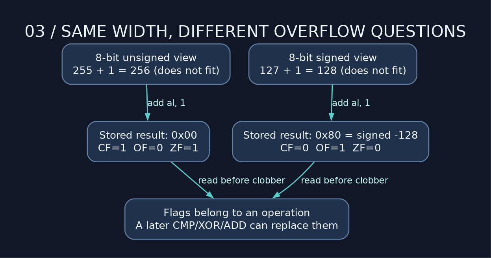

# 03 — Arithmetic and flag drama

> **NSD / STATUS FLAGS** — Arithmetic leaves flags behind. Useful evidence, short shelf life. Read them before the next instruction overwrites the part you needed.

**Lab:** [arithmetic example](../examples/03_arithmetic_and_flag_drama.asm), exit `0`.

## Arithmetic is width-limited

`add eax,esi` keeps the low 32 bits of the sum in EAX. `sub`, `inc`, `dec`, and `neg` similarly operate at their encoded width. Once you've used all the bits, that's the entire register. Need a wider number? We get to build one ourselves.

For an eight-bit operation, 255 + 1 wraps to 0. The CPU reports information about this through flags. In C, unsigned arithmetic wraps too; C signed-overflow rules are different. Do not use assembly's wrap behavior to justify undefined signed C arithmetic.

| Flag | Meaning after ordinary add/sub |
| --- | --- |
| CF | Carry/borrow relevant to unsigned arithmetic |
| OF | Result does not fit the signed width |
| ZF | Result is zero |
| SF | Most significant result bit |
| PF | Even parity of the low byte, not the whole result |



`255 + 1` in a byte gives zero, CF=1, OF=0. `127 + 1` gives `0x80`, CF=0, OF=1. Same addition instruction; two different questions about representability.

## Read the flags before losing the evidence

```nasm
mov rax, -1
mov edx, 0
add rax, 1      ; low half wraps, CF=1
adc rdx, 0      ; high half adds the carry: RDX:RAX = 1:0
```

`adc` adds both its operand and incoming CF. `sbb` subtracts its operand and incoming borrow. This creates arithmetic on numbers wider than one register.

Slip `xor r8d,r8d` between ADD and ADC and you've cleared the carry you needed. A perfectly good zeroing instruction, in the wrong fucking place. `mov r8d,0` leaves the flags alone. `inc/dec` preserve CF but change other arithmetic flags. Track exactly the flags your next branch or carry operation consumes.

`cmp a,b` computes subtraction for flags but discards the result. `test a,b` does likewise for bitwise AND. Neither writes an arithmetic result to its operands.

## Multiplication comes in different contracts

`imul eax,eax,53` computes a signed product, keeps low 32 bits, and reports signed overflow in CF/OF. `mul rcx` instead uses implicit RAX and produces the full unsigned product in RDX:RAX. One-operand `imul rcx` produces the corresponding full signed product.

Do not branch on ZF after `mul/imul` as though it were a defined zero-result flag. Use `test` or `cmp` on the result you intend to inspect.

## Division uses two registers as input

```nasm
mov eax, 689
xor edx, edx
mov ecx, 53
div rcx             ; unsigned RDX:RAX / RCX -> RAX=13, RDX=0

mov rax, -53
cqo                 ; sign-extend RAX into RDX:RAX
mov ecx, 13
idiv rcx            ; quotient -4, remainder -1
```

Inspect RDX before DIV. It is part of the input dividend as well as the eventual remainder output. Leave an old remainder there and you've asked the CPU to divide a different number. For unsigned division of a single 64-bit number, clear RDX. For signed division, use `cqo`; the 32-bit equivalent is `cdq` before `idiv ecx`.

The divisor must be a register or memory operand; `div 10` is not an encoding. A zero divisor or a quotient too large for the destination raises a divide exception, normally SIGFPE on Linux. Even `INT64_MIN / -1` overflows. Integer division faults do not imply your program used floating point.

## Drill and answer

Compute 100 / 13: expected quotient 7, remainder 9. Inspect both. Repeat with −100 and signed division: quotient −7, remainder −9, because division truncates toward zero and remainder follows the dividend's sign.

Then explain why `lea rax,[rdi+rdi*4]` gives 5×RDI without touching arithmetic flags. LEA calculates an address-shaped expression; it does not dereference it and cannot encode arbitrary algebra.

---

[Course map](../README.md) · [Previous: 02](02_memory_and_pointer_hell.md) · [Next: 04](04_branches_loops_and_bit_wizardry.md)

Companion: [original GAS lecture](../../gas_asm_lecture/03_arithmetic_and_flag_drama.asm).

Manuals: [reference index](../REFERENCES.md).
