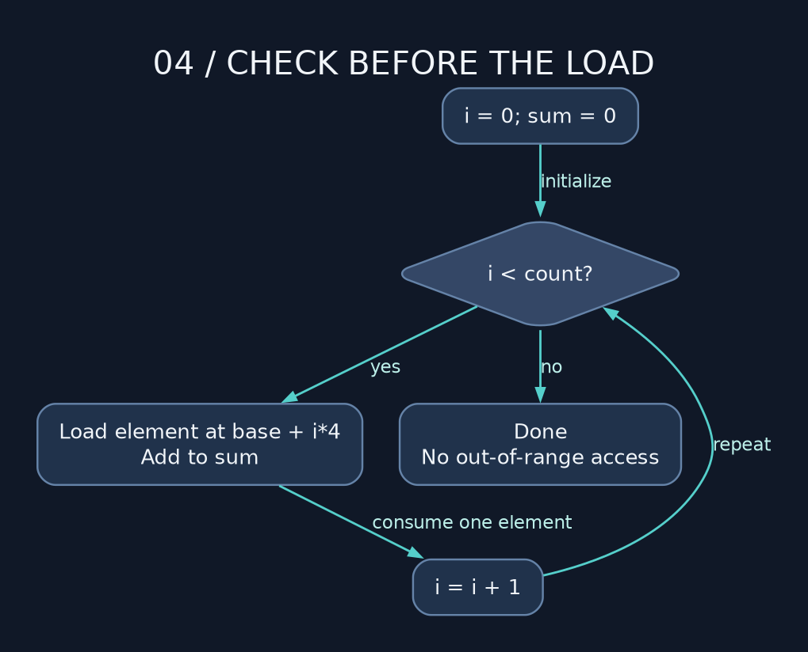

# 04 — Branches, loops, and bit wizardry

> **NSD / CONTROL FLOW** — Now we get to redirect execution. Pick the condition carefully: the CPU is perfectly willing to spend all night in the wrong loop.

**Lab:** [control-flow example](../examples/04_branches_loops_and_bit_wizardry.asm), exit `0`.

## Translate an if statement

For `if (a < b)`, first decide whether the C operands are signed or unsigned. Both versions can use the same `cmp` but need different conditions:

```nasm
cmp eax, ebx       ; flags describe EAX - EBX
jl signed_less     ; signed EAX < signed EBX
; or jb unsigned_less for an unsigned comparison
```

| Relation after `cmp a,b` | Unsigned branch | Signed branch |
| --- | --- | --- |
| equal / unequal | je / jne | je / jne |
| less / less-or-equal | jb / jbe | jl / jle |
| greater / greater-or-equal | ja / jae | jg / jge |

For `eax=0xffffffff` and `ebx=1`, unsigned EAX is above EBX; signed EAX is below EBX. Registers contain identical bits in both interpretations. `jl` combines SF and OF, not merely the sign bit, because subtraction itself can overflow.

`jz` and `je` are names for the same ZF condition. `jmp` is unconditional. When a conditional jump isn't taken, execution continues with the next instruction. Your carefully named label won't stop it. We have to put the actual branch there.

## Give the loop a job and an exit



```nasm
xor ecx, ecx       ; i = 0
xor eax, eax       ; sum = 0
.loop:
    cmp rcx, rdx   ; count in RDX
    jae .done      ; zero-length input exits before touching memory
    add eax, [rsi + rcx*4]
    inc rcx
    jmp .loop
.done:
```

Before each iteration, ECX identifies the next element and EAX is the sum of previous elements modulo 2^32. That statement is the loop invariant. Initialization establishes it; the body preserves it; the bound prevents an extra load.

Watch the memory operand while stepping. You can increment RSI all night, but `[num]` still reads the same address. The comment might say 'next character'; the instruction disagrees. That's exactly what happened in the original input parser.

## Masks and shifts

A mask selects bits. `and eax,0xff` keeps the low byte; `or eax,8` sets bit 3; `xor eax,8` toggles it. `test eax,8` checks that bit without modifying EAX. `not` flips all bits and leaves flags unchanged.

`shl` shifts left and inserts zeros. `shr` shifts right with zeros. `sar` shifts right while replicating the sign bit. Negative arithmetic right shift rounds toward negative infinity: −3 shifted right once is −2, whereas signed division −3/2 truncates to −1. Do not substitute blindly.

Variable ordinary shift counts use CL. Counts are masked by the instruction width rules: for a 64-bit operand, a count of 64 becomes zero. `shl rax,64` therefore does not clear RAX. Rotates (`rol/ror`) circulate bits within the width rather than discarding all shifted-out bits. Flag behavior depends on the count; do not extrapolate one-bit rules to all counts.

## Condition to value

`setcc` writes exactly one byte. `setl al` does not clear the rest of EAX. Follow it with `movzx eax,al` if you need a full integer Boolean. Clear registers before the comparison if using XOR; clearing between CMP and SETcc destroys the flags you needed.

`cmovcc` conditionally copies a register-sized value. It is not inherently faster than a branch, and a memory source cannot be used as a general way to suppress an invalid load. Get the condition and accesses right first. If we're going to claim it's faster, bring measurements.

**Drill:** change the array loop to sum 64-bit signed values. Change both the load width and stride; define overflow behavior. Then handle an empty array without performing any load. A correct loop is a proof about every iteration, not just one friendly example.

---

[Course map](../README.md) · [Previous: 03](03_arithmetic_and_flag_drama.md) · [Next: 05](05_stack_calls_and_recursion.md)

Companion: [original GAS lecture](../../gas_asm_lecture/04_branches_loops_and_bit_wizardry.asm).

Manuals: [reference index](../REFERENCES.md).
