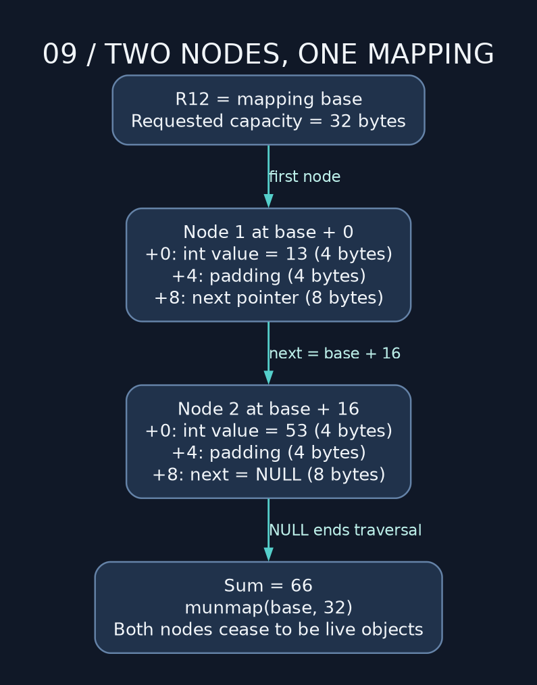

# 09 — mmap, structs, and ownership in the wild

> **NSD / MAPPING CONTROL** — Request memory, build the objects, release the mapping. Keep the original address somewhere safe. Cleanup gets considerably harder after you lose the fucking pointer.

**Lab:** [mapping example](../examples/09_mmap_and_structs_in_the_wild.asm), status `0` on success, `1` on mapping failure, `53` on an internal value mismatch after cleanup.

## Static, stack, and dynamic lifetime

`.data` and `.bss` storage normally lasts for the process lifetime. A local stack reservation lasts until its frame is released. A dynamic mapping lasts until it is unmapped or the process exits. The same numerical pointer does not guarantee the same live object across time.

`mmap` creates a virtual-memory mapping. `malloc` usually suballocates from larger regions with allocator metadata; one syscall per tiny object is not an efficient general allocator.

The example requests space for two 16-byte nodes. The kernel maps whole pages as needed, but the program's logical capacity remains the requested 32 bytes. The kernel's page rounding doesn't enlarge the object we agreed to manage. Keep the 32-byte bound in the calculation.

## The six arguments

| Register | mmap argument | Example value |
| --- | --- | --- |
| RDI | preferred address | 0: kernel chooses |
| RSI | requested length | 32 |
| RDX | protections | 3: read + write |
| R10 | flags | 0x22: private + anonymous |
| R8 | file descriptor | −1 for this anonymous mapping |
| R9 | file offset | 0 |

RAX=9 selects mmap. Argument four belongs in R10, not RCX. Success returns the base address. For raw pointer-returning syscalls, test the Linux error range with `cmp rax,-4095` followed by unsigned `jae`. This distinguishes the encoded error values using the documented raw ABI.

Libc mmap's `(void *)-1` and `errno` interface is a wrapper contract, not the exact raw return protocol used here.

## Structs are offsets plus layout rules

C model on our ABI:

```c
struct node {
    int value;          // 4 bytes at offset 0
                        // 4 bytes padding
    struct node *next;  // 8 bytes at offset 8
};                      // size 16, alignment 8
```



The NASM example defines `NODE_VALUE equ 0`, `NODE_NEXT equ 8`, and `NODE_SIZE equ 16`. It allocates two nodes in one region, stores 13 and 53, points the first at the second, and terminates the chain with a null pointer.

NASM gives us `struc/endstruc` to name offsets. Handy, but it doesn't interrogate the C compiler and discover its layout for us. When sharing structs with C, compare `sizeof`, `_Alignof`, and `offsetof`. Packing options can change the interface. A four-byte padding region is not a hidden integer field.

## Walk the list; keep the cleanup address

Walking the list means loading a signed dword value, adding it to a wide sum, and loading the qword `next` pointer for the next iteration. The expected sum is 66. The example trusts the two nodes it constructed; arbitrary serialized bytes require separate bounds, pointer validation, and cycle handling.

R12 retains the original mapping base for `munmap`. R13D retains the planned exit status across that syscall, which overwrites RAX. Lose the base and cleanup has no valid address. Lose the saved status and a successful cleanup can hide the failure we meant to report. I want both values accounted for before the syscall.

After munmap, clearing R12 avoids accidentally reusing that particular register as a live pointer. Every other copied pointer still holds its old bits. Freed memory does not send a recall notice to your registers. No instruction can automatically find every copied address in your process and invalidate it as a typed reference.

**Drill:** add a third node containing −1, request 48 bytes, and expect sum 65. Verify cleanup on both the success and mismatch paths. Then replace `next` pointers with offsets from the mapping base and explain why offsets are easier to serialize or relocate.

---

[Course map](../README.md) · [Previous: 08](08_syscalls_and_io_thingy.md) · [Next: 10](10_float_and_simd_fuckery.md)

Companion: [original GAS lecture](../../gas_asm_lecture/09_mmap_and_structs_in_the_wild.asm).

Manuals: [reference index](../REFERENCES.md).
