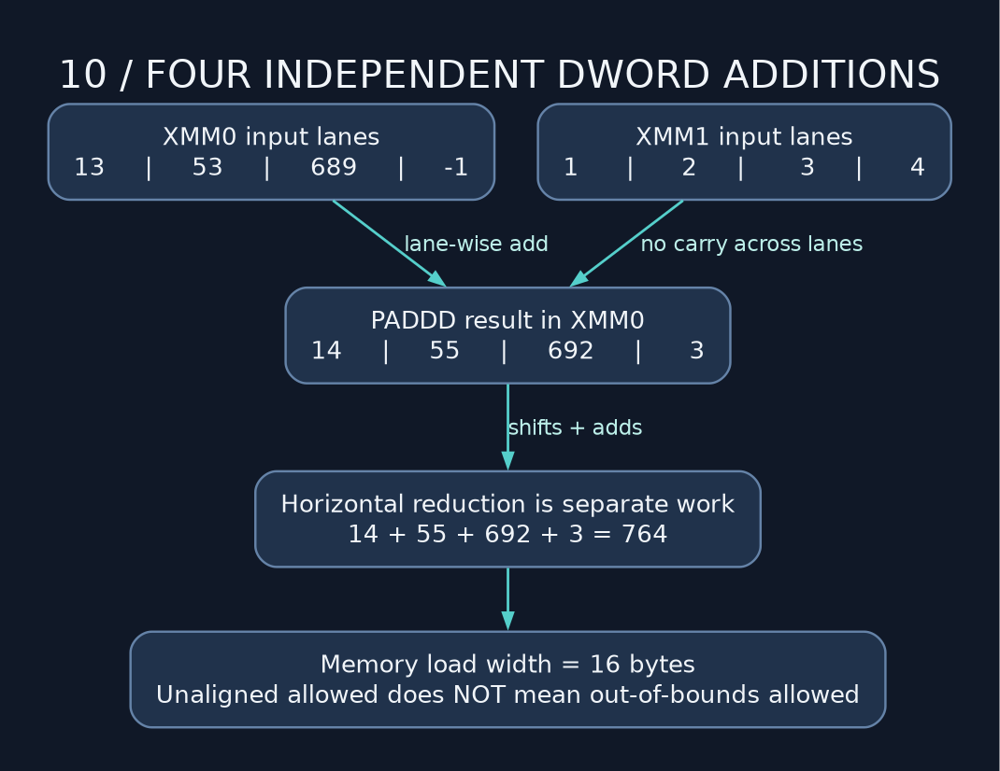

# 10 — Floating point and SIMD without the mythology

> **NSD / VECTOR UNIT** — Vector unit online. We get several lanes of arithmetic and a wider memory access to account for. Check the bounds before admiring the throughput.

**Lab:** [SSE2 example](../examples/10_float_and_simd_fuckery.asm), exit `0`. No AVX requirement.

## Inspect the number format first

IEEE binary32 uses 1 sign bit, 8 exponent bits, and 23 fraction bits. Binary64 uses 1, 11, and 52. Normal values include an implicit leading significand bit; special encodings represent subnormals, zeros, infinities, and NaNs.

Not every decimal fraction has a finite binary representation. `0.5` is exact; `0.1` generally is not. We removed the compiler, not the number format. Rounding is still on the job. Floating-point addition can lose small contributions next to much larger magnitudes and is not generally associative.

`dq 13` stores an integer bit pattern; `dq 13.0` stores a floating-point representation. Copying integer bits into an XMM register does not convert their numeric meaning.

## Scalar operations in vector registers

XMM0–XMM15 are 128-bit registers in 64-bit mode. Scalar double instructions use the low 64-bit lane; scalar float instructions use the low 32-bit lane. Different instructions have different effects on upper bits, so inspect their contracts instead of assuming every scalar operation clears the register.

```nasm
mov eax, 13
cvtsi2sd xmm0, eax       ; numeric signed integer -> double 13.0
addsd xmm0, [rel half]   ; 13.5
addsd xmm0, xmm0         ; 27.0
cvttsd2si eax, xmm0      ; signed integer 27, truncating toward zero
```

`cvtsd2si` uses the selected MXCSR rounding mode; `cvttsd2si` explicitly truncates. Out-of-range or NaN conversion can produce the integer-indefinite value with masked exceptions. That bit pattern can also represent a valid minimum integer; validate domains if the distinction matters.

MXCSR controls SSE rounding and exception state. If you change those settings, check the ABI's preservation rules. The next routine has its own arithmetic to do; don't quietly rewrite its environment.

## Comparisons need an unordered case

`ucomisd` sets flags for ordered relations or unordered NaN cases. If NaN is possible, use `jp` to inspect PF before interpreting equality or less-than flags. Unordered sets ZF/PF/CF together; jumping straight to `je` can mistake an unordered comparison for equality.

The sample intentionally compares a quiet NaN and checks the unordered condition. A floating comparison is not the same condition-code protocol as signed integer CMP.

## Packed operations: independent lanes



`paddd` adds four 32-bit lanes independently, wrapping in each lane. It does not propagate carry from one lane into the next like a 128-bit integer adder. The example adds `{13,53,689,-1}` and `{1,2,3,4}` to get `{14,55,692,3}`, then reduces the lanes to sum 764.

`movdqu` permits an unaligned sixteen-byte memory access. `movdqa` requires sixteen-byte alignment for its memory forms. Neither instruction grants extra buffer space. MOVDQU forgives misalignment, not a fucked address range. Three remaining int32 elements occupy twelve bytes; an unaligned sixteen-byte load still reads four extra bytes.

A real array routine handles full vector chunks followed by a scalar tail, or another explicitly safe tail strategy. Empty input must avoid all loads. Packed saturating additions such as `paddusb` differ from wrapping additions such as `paddb`; choose deliberately.

## Wider is a separate target

SSE2 is baseline for our x86-64 course. AVX and AVX-512 require feature checks and operating-system state support. For AVX, CPUID alone is insufficient; OSXSAVE/XGETBV state support matters too. Keep unsupported instructions off execution paths on older targets.

**Drill:** sum seven signed int32 elements using a four-lane chunk and a three-element tail. State whether sums wrap in 32 bits or widen to 64 bits, and test negative values and zero length. Compare outputs before measuring speed. A wider register does not owe you a throughput improvement.

---

[Course map](../README.md) · [Previous: 09](09_mmap_and_structs_in_the_wild.md) · [Next: 11](11_atomic_does_not_mean_nuclear.md)

Companion: [original GAS lecture](../../gas_asm_lecture/10_float_and_simd_fuckery.asm).

Manuals: [reference index](../REFERENCES.md).
