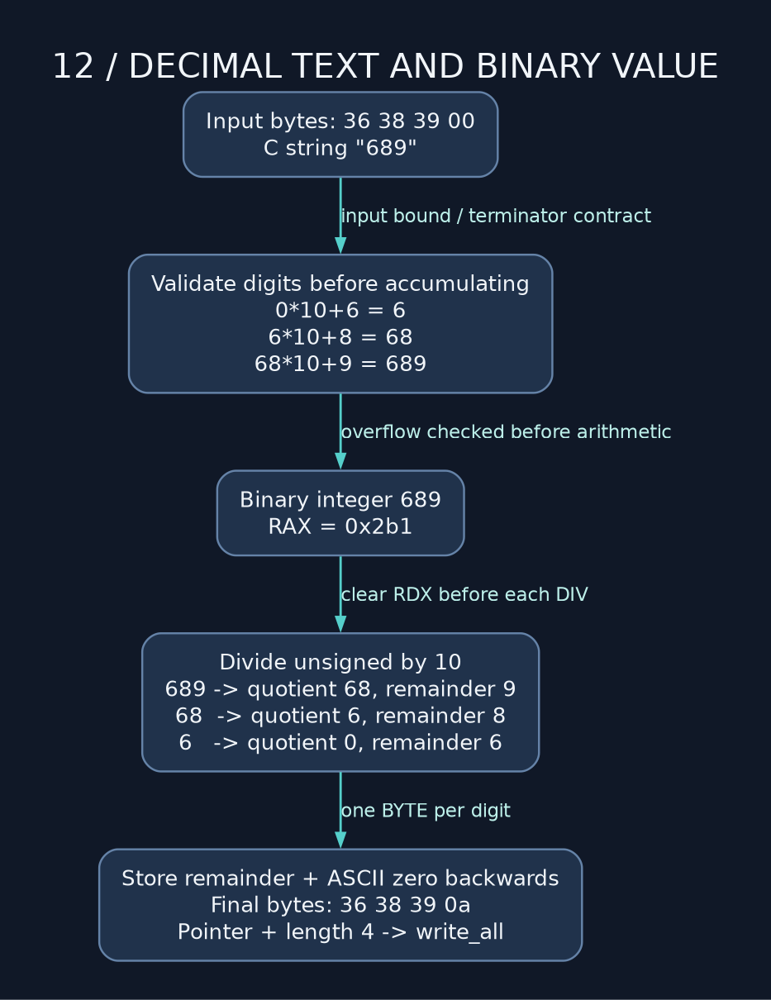

# 12 — Final boss: argv, decimal parsing, and FizzBuzz

> **NSD / FIELD EXERCISE** — Enough isolated instructions. We're taking input through validation, arithmetic, formatting, and output. Small program, full responsibility for every byte.

**Lab:** [complete FizzBuzz program](../examples/12_fizzbuzz_final_boss.asm). Default upper bound: 30. Optional argument: decimal 1..10000. Invalid input exits `13`; I/O failure exits `1`; success exits `0`.

```sh
./build/12_fizzbuzz_final_boss 16
```

Expected lines: `1`, `2`, `Fizz`, `4`, `Buzz`, `Fizz`, `7`, `8`, `Fizz`, `Buzz`, `11`, `Fizz`, `13`, `14`, `FizzBuzz`, `16`.

## Process startup gives an argument array

At `_start`, `[rsp]` is argc, `[rsp+8]` is the pointer argv[0], and `[rsp+16]` is the pointer argv[1] if it exists. The pointer array ends with a null pointer; each argument string separately ends with a zero byte. One terminator belongs to the pointer array, the other to a string. Different widths, different addresses. Dump both if that distinction is still hazy.

Inspect argc before reading argv[1]. The sample accepts no argument or exactly one, rejects extras, and reads startup data before repurposing stack space. Unlike `main`, `_start` does not receive argc in EDI and argv in RSI.

## Parsing is a state machine

For each digit: `value = value * 10 + digit`. Start with value zero, reject an empty string, validate the character, bound the next result, then accumulate.



For a limit L and next digit d, avoid overflow by checking `value <= (L-d)/10` before multiplication. The sample's L=10000 allows an equivalent simpler check: previous value below 1000, or equal to 1000 with next digit zero. Final zero is rejected because the domain starts at 1. Leading zeros are accepted.

A general uint64 parser would use cutoff 1844674407370955161 and final digit limit 5. Check after an unchecked multiply/add and a huge input may already have wrapped into a friendly-looking small number. Too late. Establish the bound before the arithmetic.

## Register jobs survive the helper calls

R12 stores the upper bound; R13 stores the current number. These survive functions following the ABI. Temporary registers hold divisors and helper arguments. RCX is not persistent state across output because syscall overwrites it.

The loop tests divisibility by 15 first, then 3, then 5. Otherwise it prints the decimal number. Checking 3 first and immediately printing Fizz would misclassify 15. Test the combined condition before the exclusive cases.

## Turn the number back into bytes

The decimal formatter repeatedly divides unsigned RAX by 10. Each remainder is the next digit from the right. Add `'0'` to obtain its ASCII byte, move the output pointer backward, and store that byte.

For 689: quotient/remainder pairs are 68/9, 6/8, 0/6. Writing backward creates contiguous `6 8 9` in forward memory order. A do-while loop emits one zero digit for input zero instead of producing an empty string.

The largest uint64 takes twenty digits. Add newline for 21 bytes; no NUL is needed for counted output. The helper reserves 40 stack bytes: enough storage plus alignment for the nested write_all call. Entry RSP has remainder 8 modulo 16; subtracting 40 makes it aligned before CALL.

The buffer remains live until write_all completes. The helper restores exactly the reserved bytes before RET. Return a pointer to that released buffer and the caller gets an address into storage we've already given back. The digits may linger long enough to fool a quick test. Don't mistake that for a working interface.

## Exercises that build on a working core

Buffer several lines before writing, preserving capacity checks and all short-write behavior. Replace divisibility tests with countdowns and compare output byte-for-byte. Add signed formatting: handle the sign and form an unsigned magnitude so INT64_MIN is representable as a magnitude.

Before adding a calculator, specify divide-by-zero and overflow behavior. “Whatever the instruction does” is rarely a useful user interface. The project's range and exit statuses are deliberately explicit so it can be tested.

**Checkpoint:** trace input `15` through argv loading, validation, register assignment, combined divisibility, and write_all. Then trace invalid `10001` and explain where rejection occurs before any FizzBuzz output.

---

[Course map](../README.md) · [Previous: 11](11_atomic_does_not_mean_nuclear.md) · [Next: 13](13_debugging_and_reading_the_nudes.md)

Companion: [original GAS lecture](../../gas_asm_lecture/12_fizzbuzz_final_boss.asm).

Manuals: [reference index](../REFERENCES.md).
