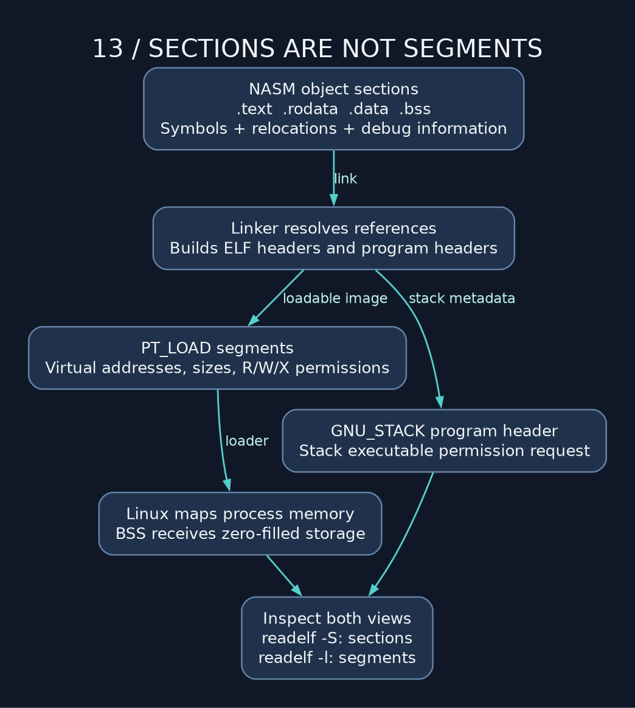

# 13 — Debugging: interrogate the machine, not your intentions

> **NSD / MACHINE INTERROGATION** — What the fuck does this actually do? Good. That's a useful question. Open GDB and bring the registers, addresses, and instruction bytes into the conversation.

**Lab:** [debugging example](../examples/13_debugging_and_reading_the_nudes.asm), exit `0`. Its array sum is 754, stored in `observed`.

## Start with a symbol and one instruction

```sh
mkdir -p build
nasm -f elf64 -g -F dwarf examples/13_debugging_and_reading_the_nudes.asm -o build/13_debugging_and_reading_the_nudes.o
ld build/13_debugging_and_reading_the_nudes.o -o build/13_debugging_and_reading_the_nudes
gdb build/13_debugging_and_reading_the_nudes
```

In GDB:

```text
set disassembly-flavor intel
break _start
run
display/i $pc
info registers rax rdi rsi rsp rip eflags
x/4wx &values
x/16bx &values
x/4gx $rsp
si
```

`si` steps one instruction, entering calls. `ni` steps over calls. Source-level `step`/`next` are different commands and can span multiple instructions. `p/x $rax` displays hex; `p/d $rax` displays a decimal interpretation. Same bits, two views. The debugger hasn't converted the value just because we asked it to print differently.

Set `break sum_four`, continue, and inspect `[rsp]` with `x/gx $rsp`. That slot should hold a return address into the caller. `finish` runs until the routine returns; then inspect RAX. Without full unwind metadata, backtraces at arbitrary prologue/epilogue positions can be incomplete. Frame pointers help but do not make every stop magically unambiguous.

## Catch the bad write

For an untyped assembly label, a cast can make a hardware watchpoint expression explicit:

```text
watch *(long long *)&observed
continue
```

Catch the write itself. Staring at corrupted memory after the program has wandered another thousand instructions gives you considerably less to work with. Similarly, an input parser's loop can be stopped at each load to check that its pointer really advances and its remaining count really shrinks.

If the environment forbids ptrace, GDB may refuse to launch a process. That is a tool/environment restriction; it does not show that your assembly crashed. You can still inspect the disassembly and ELF. Identify which layer refused the operation before debugging a process that never reached its first instruction.

## Open the ELF and check the paperwork

```sh
readelf -h build/13_debugging_and_reading_the_nudes
readelf -S build/13_debugging_and_reading_the_nudes
readelf -l build/13_debugging_and_reading_the_nudes
nm -n build/13_debugging_and_reading_the_nudes
objdump -d -Mintel build/13_debugging_and_reading_the_nudes
readelf -r build/13_debugging_and_reading_the_nudes.o
```



Sections organize code/data for tools. Loadable segments tell Linux what to map and with which permissions. BSS can contribute more in-memory size than file-backed size. `.note.GNU-stack` tells the linker this object does not need an executable stack; inspect the resulting GNU_STACK program header rather than merely trusting a comment.

Relocations describe addresses/displacements to resolve. RIP-relative addressing is relative to the next instruction. Inspect object relocations before linking and compare the executable afterward. `default rel` is not a universal “turn this program into PIE” switch.

## A fault has a layer and an operand

| Symptom | First things to inspect |
| --- | --- |
| Assembler error | syntax, missing labels, operand widths, selected format |
| Linker error | duplicate entry points, extern definitions, relocation type |
| SIGSEGV | faulting address, permissions, width, buffer lifetime, return slot |
| SIGFPE | divisor, high dividend half, quotient overflow |
| Wrong number | sign extension, width, stale flags, arithmetic bounds |
| Crash in printf | stack alignment, format, argument registers, AL |
| Infinite loop | advancing operand, bound, flag clobbers, EOF handling |
| SIGILL | unsupported ISA extension or execution reaching data |

x86 instructions have variable length, up to fifteen bytes. A jump into the middle can decode a different instruction stream. “The bytes disassemble” alone does not prove the intended control flow.

## Ask the compiler, then measure

Create `/tmp/add.c` containing `long add(long a,long b) { return a+b; }`. Run `gcc -O2 -S -masm=intel /tmp/add.c -o /tmp/add.s` and inspect it. GCC emits GAS directives even when choosing Intel instruction syntax. Do not feed that output directly to NASM.

Optimization can remove variables or rearrange work. A shorter listing can still run slower. I want measurements before we put 'optimized' in the filename. Measure realistic inputs; consider memory locality, dependency chains, branch predictability, and syscall counts. The first optimization for per-digit output is usually buffering, not obscure arithmetic.

**Drill:** break at sum_four, predict each register change, then step. Introduce a wrong array stride and use the actual load addresses to explain the resulting mismatch.

---

[Course map](../README.md) · [Previous: 12](12_fizzbuzz_final_boss.md) · [Next: 14](14_x86_32_time_machine.md)

Companion: [original GAS lecture](../../gas_asm_lecture/13_debugging_and_reading_the_nudes.asm).

Manuals: [reference index](../REFERENCES.md).
