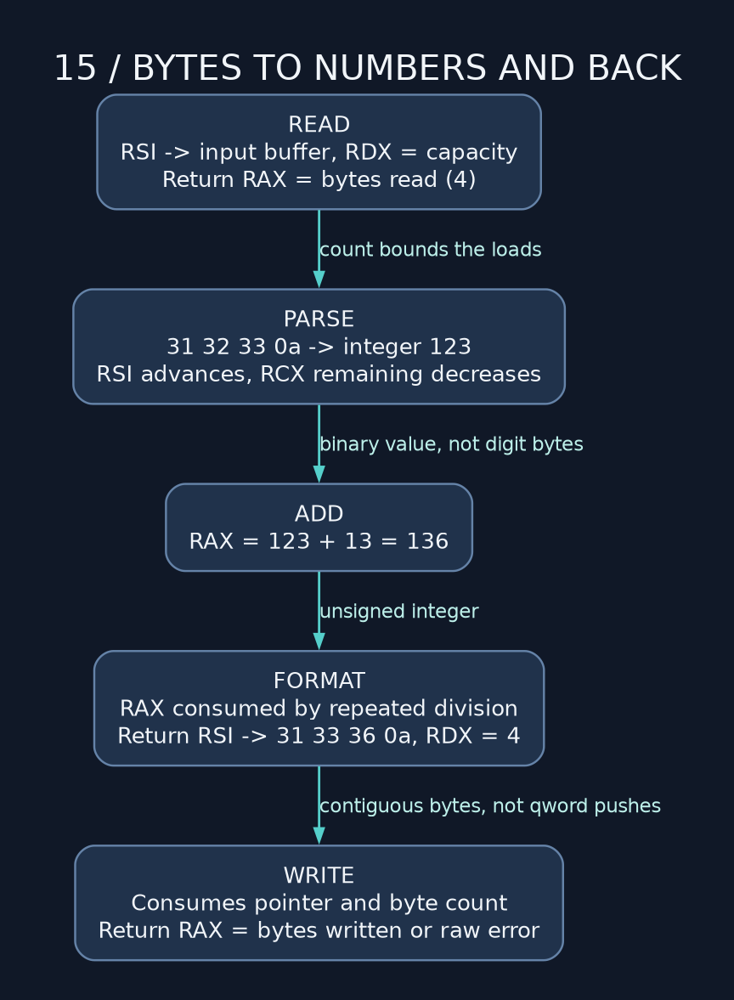

# 15 — Neuro's input program, from bytes to number and back

> **NSD / INCIDENT RECONSTRUCTION** — Back to the program that started this mess. Several bugs, several broken assumptions. We'll trace one input all the way through and account for each failure.

**Prerequisites:** 01–08 and the decimal conversion in 12. **Lab:** [standalone tutorial copy](../examples/15_bytes_to_numbers_and_back.asm), preserved from the earlier input experiment (the current [experiment directory](../../nasm_experiments/) contains `00_init.asm`). Accepts 1–12 unsigned decimal digits in one read, adds 13, prints the result and newline.

## Follow one concrete input

For input `123` followed by Enter:

| Boundary | State |
| --- | --- |
| Before read | RSI points at buffer, RDX is capacity 13 |
| After read | RAX=4; bytes are `31 32 33 0a` in hexadecimal |
| After parsing | RAX=123, a binary integer |
| After addition | RAX=136 |
| After formatting | RSI points at bytes `31 33 36 0a`, RDX=4 |
| After write | RAX is a byte count/error, not 136 |



The character `'1'` is 49, not the integer 1. Subtracting `'0'` converts an already validated digit to its value. Walk it: `0*10+1=1`, then `1*10+2=12`, then `12*10+3=123`. That's the entire decimal accumulation. No recursion required, just a pointer that actually moves.

## The parser's state belongs to the loop

The fixed parser uses RSI for the current address, RCX for remaining readable bytes, R8D for digit count, and RAX for the accumulator. Before a load it checks that bytes remain. It stops at newline or the read boundary, rejects nondigits, and rejects empty input or more than twelve digits.

`sub edx,'0'` followed by unsigned `cmp edx,9 / ja invalid` rejects characters below `'0'` too: their negative differences become large unsigned values. That saves two comparisons without changing the accepted character set.

Twelve decimal digits fit far below uint64 maximum, including the added 13. The input-length bound therefore establishes the arithmetic bound. If you remove the length check, revisit overflow too. A bigger buffer doesn't give the accumulator more bits.

## Where the recursive version went off the rails

The original parser incremented RSI but loaded `[num]` every time. RSI moved; the actual load didn't. The comment described progress that the instruction never made. It also pushed RSI without popping it, referenced an undefined `.done`, and replaced RAX with one digit rather than accumulating decimal place value.

You can write a correct recursive parser. Here it mostly gives us more stack state to keep alive and more ways to fuck up RET. A loop expresses the necessary progress directly: one byte consumed, one digit accumulated, one count reduced.

Do not subtract `'0'` in the original buffer unless modifying the input is part of your contract. The fixed implementation loads a byte into a register, converts there, and leaves the input bytes available for inspection.

## Formatting: division plus byte stores

Start at the end of a 21-byte output buffer and store newline. Divide the number by ten, add `'0'` to DL, decrement the output pointer, and store `mov [rsi],dl`. Repeat while quotient is nonzero.

For 136, remainders arrive 6, 3, 1. The backward stores arrange them as `1 3 6` in increasing memory addresses. The loop runs at least once so an input integer zero would format as `0`, even though this particular program adds 13 first.

The broken version used `push rdx` per digit. Each push occupied eight bytes, leaving seven extra bytes between digit characters. A digit count was not a byte count for that layout. Then `syscall` overwrote RCX, so using RCX to restore RSP destroyed the return path again.

The fixed version never uses the call stack as a pile of individually pushed digit characters. It returns a pointer/length pair, and `_print_result` consumes that pair exactly once. A label between formatting and printing would not stop fall-through by itself; the formatter needs its actual RET.

## Limits of this deliberately small exercise

The tutorial copy shares the experiment's **one-read** input strategy and **one-write** output strategy. It is intended for short interactive inputs or input delivered as one chunk. A pipe can split a number across reads, so this is not a robust general streaming line reader. A write can be short too; chapter 08's write_all addresses that separately.

The first newline ends the parse; extra bytes from the same read are ignored. EOF after digits works without a newline. A sign, spaces, CRLF carriage return, and nondigits are rejected. Read failures and invalid data currently share the same error message. The caller also does not check write failures, so status zero here is not proof that all output reached its destination. These boundaries are explicit teaching simplifications, not Linux guarantees.

## Build and test

```sh
mkdir -p build
nasm -f elf64 -g -F dwarf examples/15_bytes_to_numbers_and_back.asm -o build/15_bytes_to_numbers_and_back.o
ld build/15_bytes_to_numbers_and_back.o -o build/15_bytes_to_numbers_and_back
printf '123\n' | ./build/15_bytes_to_numbers_and_back
printf '999999999999\n' | ./build/15_bytes_to_numbers_and_back
printf '12x\n' | ./build/15_bytes_to_numbers_and_back
```

Expected successful output lines are `Enter a number: 136` and `Enter a number: 1000000000012`. The invalid case prints its prompt on stdout, an explanation on stderr, and exits 1.

**Next exercise:** implement a line reader that loops across partial reads, retains incomplete input, recognizes newline/EOF, and rejects overlong lines without silently treating their prefix as a complete value. Then replace the single write with write_all. Keep the parser and formatter contracts separate so improving I/O does not require rewriting arithmetic.

---

[Course map](../README.md) · [Previous: 14](14_x86_32_time_machine.md) · [Next: 16](16_nasm_directives_macros_and_gas_translation.md)

Manuals: [reference index](../REFERENCES.md).
